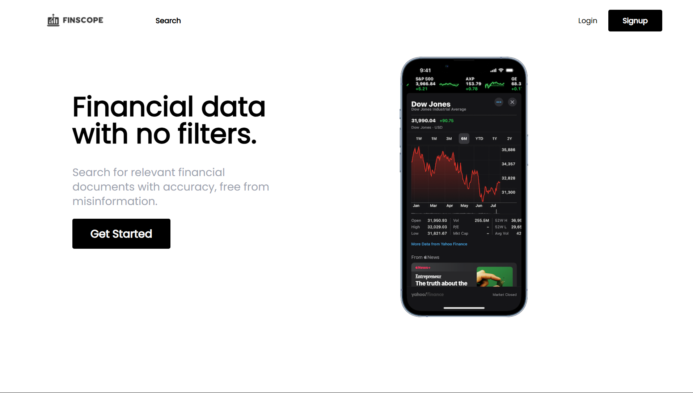

# FinScope

**FinScope** is a financial tracking application that helps users track and explore financial data for companies, including stock prices, market capitalization, financial statements, and other key metrics. The app provides real-time updates on your portfolio and allows you to analyze essential financial data to make informed investment decisions.

<p align="center">
  
</p>

## Features

- **Real-time Portfolio Tracking**: Track your stock portfolio and view live updates on market performance.
- **Company Financial Data**: Access key financial metrics such as earnings, revenue, market cap, and stock price.
- **Company Financial Statements**: View and analyze financial statements to evaluate company performance.
- **User-Friendly Interface**: Enjoy a seamless and intuitive experience with a React + TypeScript frontend and a secure backend built with ASP.NET Core.

<p align="center">
  
</p>

## Tech Stack

- **Frontend**: React, TypeScript
- **Backend**: ASP.NET Core, Microsoft SQL Server
- **Authentication**: Secure JWT authentication

## Installation

To run this project locally, follow the steps below:

### Prerequisites

Make sure you have the following installed on your local machine:

- **Node.js** and **npm** (for the frontend)
- **.NET Core** SDK (for the backend)
- **SQL Server** (or any SQL-compatible database)

### Setting Up the Backend

1. Clone the repository:
 ```bash
 git clone https://github.com/your-username/FinScope.git
 cd FinScope
```

2. Navigate to the backend directory and restore dependencies:
```bash
cd api
dotnet restore
```

3. Run the backend:
```bash
dotnet run
```

### Setting Up the Frontend

1. Navigate to the frontend directory:
```bash
cd frontend
```

2. Install dependencies:
```bash
npm install
```

3. Create an .env file in the root of the frontend directory and add the following:
```bash
REACT_APP_FMP_API_KEY={YOUR_FMP_API_KEY}
REACT_APP_API_URL={YOUR_BACKEND_URL}
```

4. Run the frontend:
```bash
npm start
```
